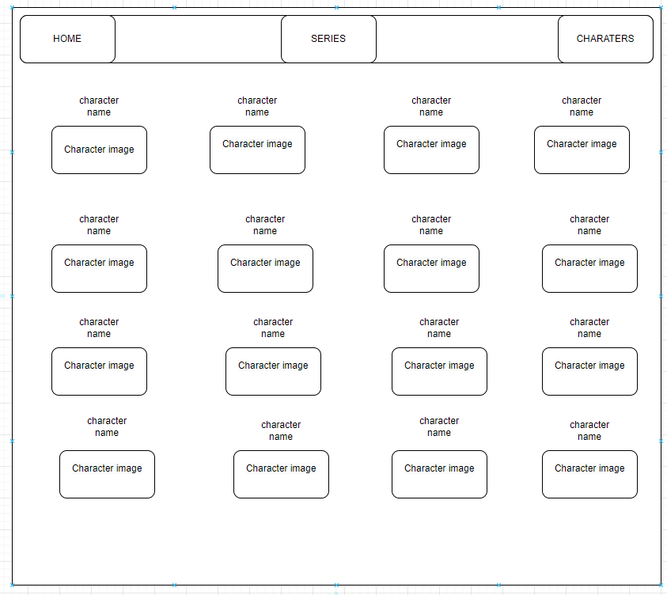
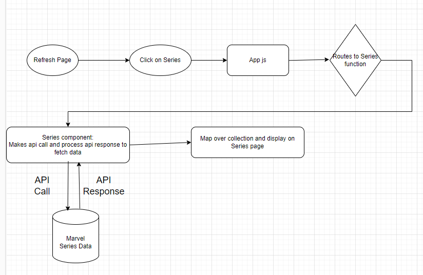

# Marvel-Project

# API   
       https://developer.marvel.com/

# Overview
   Hello, and welcome to the Marvel API project. This application allows users to search for Marvel characters and series .
# Setup 
   commands in vscode: npm create vite@latest
                       npm install
                       npm install react-router-dom
        after these commands we've to check dependencies in package.jason.next  give' npm run dev ' to request the local host.
        
# Setting Up The Environment

# steps
        ==> Creating A Marvel Developer Account
               Start by navigating to the Marvel API Documentation page and clicking on the 'Get A Key' link located near the top of the page. If you do not already have a Marvel Developer account, you will be prompted to create one.
        ==> Creating A Marvel API Key
               At this point you should be taken to the Marvel Developer Account page. You should be presented with a public and private API key by default.
        ==> Adding The API Key To The Application
               For this we need timestamp and md5 hash value

     Generating timestamp: In 2 ways i tried to generate it
         1. https://www.unixtimestamp.com/  --> Provides The Current Epoch   Unix Timestamp to be used as timestamp input
         2. run "date +%s"  command in vscode terminal
           Generating md5 hash value:
         For example, a user with a timestamp 777, public key of "1234" and  a private key of "abcd" we need to generate md5 of string 
         1. one way is to use https://www.md5hashgenerator.com/ to generate md5 hash 
         2. Other way is to run unix command in vscode terminal: echo -n 'md5InputString' | md5sum 

 # End Points

      For Characters:  
      https://gateway.marvel.com/v1/public/characters?&ts=your timestamp&apikey=your apikey&hash=your hash value 

      For Series:
      https://gateway.marvel.com/v1/public/series?&ts=your timestamp&apikey=your apikey&hash=your hash value     

 # understand the Documentation thoroughly and decide how your page look like and what data you want to display on your page.
    Here I wanted to display Characters and Series on my Page.
 # components
      Nav.jsx
      CharactersList.jsx
      Series.jsx and 
      Footer.jsx
 # pages
      Characters.jsx
      Home.jsx
      Series.jsx
# Technologies 
       Html,css,React js

# WireFrame for Characters
 
   

# FLowChart 

   

# Images

   https://wallpapers.com/

# Deployed site:

   https://priyanka-marvel-project.netlify.app/

